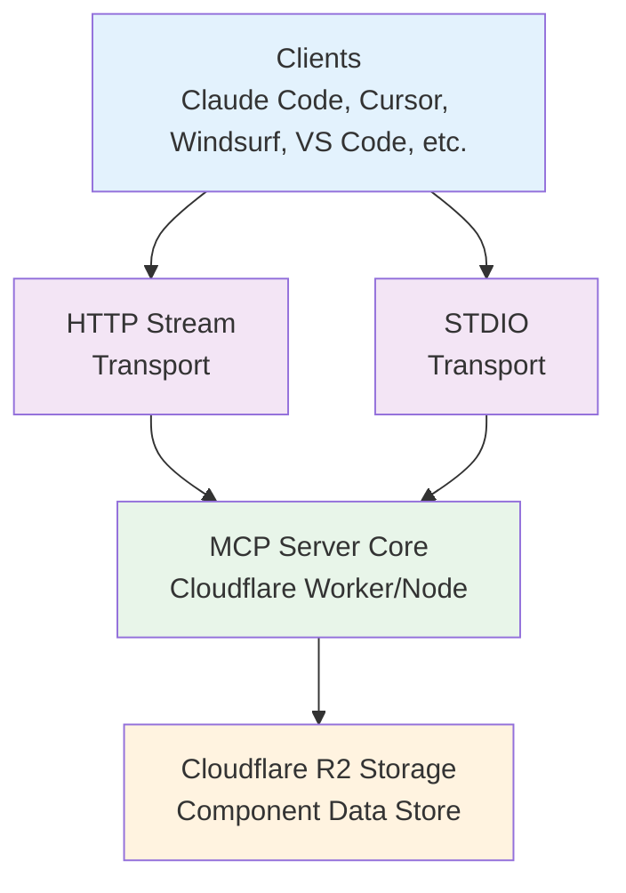

# HeroUI MCP Architecture

## Overview

The HeroUI MCP server provides component documentation via Model Context Protocol (MCP) with two transport methods and a unified data source.



## Transport Methods

### 1. HTTP Streamable Transport

- **URL**: `https://mcp.heroui.com`
- **Deployment**: Cloudflare Workers
- **Direct R2 Access**: Yes
- **Use Case**: Cloud-based AI assistants

### 2. STDIO Transport

- **Package**: `@heroui/mcp` (npm)
- **Deployment**: Local Node.js process
- **R2 Access**: Via HTTP API calls
- **Use Case**: Local IDE integrations

## Data Flow

### Component Data Extraction

1. **GitHub Actions** (Daily/Manual)
   - Checks npm for new versions
   - Extracts documentation from GitHub
   - Uploads to R2 bucket

2. **R2 Storage Structure**
   ```
   heroui-mcp-data/
   ├── components/
   │   ├── heroui/
   │   │   ├── latest.json
   │   │   └── v3.0.0-alpha.31.json
   │   └── native/
   │       ├── latest.json
   │       └── v1.0.0-alpha.13.json
   └── metadata/
       └── versions.json
   ```

### API Endpoints

The server exposes REST API endpoints for component data:

- `GET /api/components/:library` - List components
- `GET /api/components/:library/:component` - Get component props
- `GET /api/components/:library/:component/example` - Get example code
- `GET /api/versions` - Get version information
- `GET /api/versions/:library` - List library versions

### MCP Tools

Four main tools are exposed via MCP:

1. **list_components** - List all components in a library
2. **get_component_props** - Get detailed props for a component
3. **get_component_example** - Get usage example
4. **check_version** - Check for updates

## Implementation Details

### HTTP Server (Cloudflare Worker)

```typescript
// src/index.ts
- Handles MCP JSON-RPC requests at POST /
- Provides REST API endpoints at /api/*
- Direct R2 bucket access via bindings
- Automatic caching for performance
```

### STDIO Server (NPM Package)

```typescript
// src/stdio-api.ts
- MCP server over STDIO transport
- Makes HTTP calls to API endpoints
- No local data storage required
- Configurable API base URL
```

### Tools System

```typescript
// src/tools/simplified-tools.ts
- Unified tool implementations
- Support for both local and API data sources
- Schema validation with Zod
- Error handling and fallbacks
```

### Data Service

```typescript
// src/services/component-data-service-r2.ts
- R2 bucket integration
- Caching layer (5-minute TTL)
- Fallback to bundled data
- Version management
```

## Environment Variables

### Production (Cloudflare Worker)

- `APP_ENV`: Environment (production/staging/development)
- `LOG_LEVEL`: Logging level
- R2 binding: `COMPONENT_DATA` (automatic)

### STDIO Client

- `HEROUI_API_URL`: API base URL (default: https://mcp.heroui.com)

### GitHub Actions

- `CLOUDFLARE_ACCOUNT_ID`: Cloudflare account ID
- `R2_ACCESS_KEY_ID`: R2 access key
- `R2_SECRET_ACCESS_KEY`: R2 secret key
- `R2_BUCKET_NAME`: Bucket name (heroui-mcp-data)
- `GITHUB_TOKEN`: GitHub API token (optional)

## Deployment

### HTTP Server (Cloudflare Workers)

```bash
# Deploy to production
pnpm deploy:production

# Deploy to staging
pnpm deploy:staging
```

### STDIO Package (NPM)

```bash
# Build package
pnpm build

# Publish to npm
npm publish
```

### Data Extraction

```bash
# Manual extraction to R2
pnpm extract:heroui-r2
pnpm extract:native-r2

# Automatic via GitHub Actions
# Runs daily or manual trigger
```

## Development

### Local Development

```bash
# Start HTTP server locally
pnpm dev

# Test STDIO with API
pnpm mcp:stdio-api

# Test with inspector
pnpm mcp:inspector-api
```

### Testing Tools

```bash
# Test via curl (HTTP)
curl https://mcp.heroui.com -X POST \
  -H "Content-Type: application/json" \
  -d '{"jsonrpc":"2.0","method":"tools/list","id":1}'

# Test via API endpoints
curl https://mcp.heroui.com/api/components/heroui
```

## Advantages

1. **Scalability**: R2 storage handles unlimited data
2. **Performance**: CDN-backed, cached responses
3. **Versioning**: All historical versions preserved
4. **Automation**: Daily updates via GitHub Actions
5. **Flexibility**: Works both online and offline
6. **Unified Source**: Single data source for all transports

## Security

- R2 bucket is private (no public access)
- API tokens have minimal permissions
- CORS configured for allowed origins
- Read-only access from Workers
- Rate limiting on API endpoints

## Future Enhancements

- [ ] WebSocket transport support
- [ ] Incremental data updates
- [ ] Usage analytics
- [ ] Component playground
- [ ] Multi-language documentation