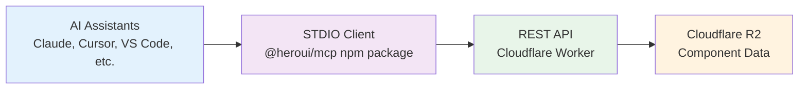

# HeroUI React MCP Architecture

## Overview

The HeroUI React MCP server provides component documentation via Model Context Protocol (MCP) using a simple STDIO transport with a REST API backend.



## Components

### 1. STDIO Client (`@heroui/react-mcp`)

- **Location**: NPM package
- **Entry**: `src/stdio.ts`
- **Installation**: `npm install -g @heroui/react-mcp@latest`
- **Purpose**: Local MCP server that AI assistants connect to
- **Features**:
  - Lightweight and simple
  - No local data storage
  - Calls REST API for all data
  - Cross-platform compatible

### 2. REST API (Cloudflare Worker)

- **Production**: `https://mcp-api.heroui.com`
- **Staging**: `https://staging-mcp-api.heroui.com`
- **Entry**: `src/api.ts`
- **Purpose**: Serves component data from R2
- **Endpoints**:
  ```
  GET /                                    # API info
  GET /health                              # Health check
  GET /components                          # List HeroUI components (latest version)
  GET /components/:component               # Component details (latest version)
  GET /components/:component/props         # Props info (latest version)
  GET /components/:component/examples      # Usage examples (latest version)
  GET /components/:component/source        # React/TypeScript source code (latest version)
  GET /components/:component/styles        # CSS styles (latest version)
  GET /docs/available                      # List available documentation paths
  GET /docs/content?path=                  # Get documentation content
  GET /versions                            # Version info
  GET /versions/:package                   # Package version
  ```

### 3. R2 Storage

- **Access**: Private (Worker only)
- **Structure**:
  ```
  components/
  └── heroui/
      ├── latest.json
      └── v3.0.0-alpha.33.json
  ```

## MCP Tools

The STDIO client exposes nine tools:

1. **installation** - Get complete installation guide for HeroUI v3

   ```javascript
   { framework: "next-app" | "next-pages" | "vite" | "general", packageManager?: "npm" | "pnpm" | "yarn" | "bun" }
   ```

2. **list_components** - List all HeroUI components (always latest version)

   ```javascript
   // No parameters required
   ```

3. **get_component_info** - Get complete component information

   ```javascript
   {
     component: "Button";
   } // Must be one of the available components
   ```

4. **get_component_props** - Get component props

   ```javascript
   {
     component: "Button";
   } // Must be one of the available components
   ```

5. **get_component_examples** - Get usage examples

   ```javascript
   {
     component: "Button";
   } // Must be one of the available components
   ```

6. **get_component_source_code** - Get React/TypeScript source code (.tsx)

   ```javascript
   {
     component: "Button";
   } // Must be one of the available components
   ```

7. **get_component_source_styles** - Get CSS styles (.css)

   ```javascript
   {
     component: "Button";
   } // Must be one of the available components
   ```

8. **get_theme_info** - Get theme variables

   ```javascript
   { theme?: "default", mode?: "light" | "dark" | "both", category?: "colors" | "all" }
   ```

9. **get_docs** - Get documentation content from HeroUI v3 docs
   ```javascript
   {
     path: "/docs/introduction";
   } // Documentation path
   ```

## Installation & Usage

### For End Users

1. Install the MCP client:

   ```bash
   npm install -g @heroui/react-mcp@latest
   ```

2. Configure your AI assistant (e.g., Claude Desktop):
   ```json
   {
     "mcpServers": {
       "heroui": {
         "command": "npx",
         "args": ["-y", "@heroui/react-mcp@latest"]
       }
     }
   }
   ```

### For Development

1. Start the API server:

   ```bash
   pnpm dev:api
   ```

2. Test the STDIO client:

   ```bash
   pnpm dev:stdio
   ```

3. Run tests:
   ```bash
   pnpm test:api    # Test API endpoints
   pnpm test:stdio   # Test STDIO client
   ```

## Deployment

### STDIO Client (NPM)

```bash
# Build
pnpm build

# Publish to NPM
npm publish
```

### API Server (Cloudflare)

```bash
# Deploy to staging
pnpm deploy:api:staging

# Deploy to production
pnpm deploy:api:production
```

## Environment Variables

### STDIO Client

- `HEROUI_API_URL` - API base URL (default: `https://mcp-api.heroui.com`)

### API Server (Cloudflare)

- `CLOUDFLARE_ACCOUNT_ID` - Cloudflare account
- `R2_ACCESS_KEY_ID` - R2 access key
- `R2_SECRET_ACCESS_KEY` - R2 secret
- `R2_BUCKET_NAME` - Bucket name
- `APP_ENV` - Environment (development/staging/production)

## Data Flow

1. **User Query** → AI Assistant
2. **AI Assistant** → STDIO Client (via MCP protocol)
3. **STDIO Client** → REST API (HTTP request)
4. **REST API** → R2 Storage (fetch data)
5. **R2 Storage** → REST API (component data)
6. **REST API** → STDIO Client (JSON response)
7. **STDIO Client** → AI Assistant (MCP response)
8. **AI Assistant** → User (formatted answer)

## Benefits

1. **Simplicity**: Single transport method, clear separation
2. **Maintainability**: Less code, easier debugging
3. **Scalability**: API can serve thousands of STDIO clients
4. **Reliability**: Cloudflare's global network
5. **Performance**: CDN caching, edge computing
6. **Cost-effective**: Pay only for what you use
7. **Developer-friendly**: Standard REST API

## Security

- **R2**: Private bucket, no public access
- **API**: Read-only operations
- **CORS**: Open (public API)
- **Rate limiting**: Cloudflare's built-in protection
- **No authentication**: Public documentation API

## Monitoring

- **API Health**: `/health` endpoint
- **Cloudflare Analytics**: Request metrics
- **Error tracking**: Worker logs
- **Performance**: Response times

## Future Enhancements

- [ ] API authentication for premium features
- [ ] Webhook notifications for updates
- [ ] Component playground API
- [ ] Search functionality
- [ ] Usage analytics
