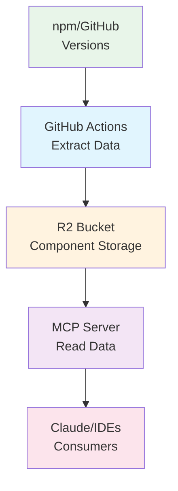

# R2 Storage Setup Guide

This guide explains how to set up and use Cloudflare R2 storage for the HeroUI MCP server.

## Architecture Overview

The HeroUI MCP server now uses Cloudflare R2 for scalable component data storage:



## R2 Bucket Structure

```
heroui-mcp-data/
├── components/
│   ├── heroui/
│   │   ├── latest.json          # Always points to newest version
│   │   ├── v3.0.0-alpha.31.json # Specific version data
│   │   ├── v3.0.0-alpha.30.json
│   │   └── ...
│   └── native/
│       ├── latest.json
│       ├── v1.0.0-alpha.13.json
│       └── ...
└── metadata/
    └── versions.json            # Version tracking metadata
```

## Setup Instructions

### 1. Create R2 Bucket

✅ **Completed**: Bucket `heroui-mcp-data` has been created in Cloudflare dashboard.

### 2. Configure GitHub Secrets

Add these secrets to your GitHub repository settings:

- `CLOUDFLARE_ACCOUNT_ID` - Your Cloudflare account ID
- `R2_ACCESS_KEY_ID` - R2 API access key ID
- `R2_SECRET_ACCESS_KEY` - R2 API secret access key
- `R2_BUCKET_NAME` - Set to: `heroui-mcp-data`
- `GITHUB_TOKEN` - (Optional) For higher GitHub API rate limits

To create R2 API tokens:
1. Go to Cloudflare Dashboard → R2 → Manage R2 API tokens
2. Create a token with permissions: **Object Read & Write**
3. Save the credentials securely

### 3. Initial Data Population

Run the extraction scripts manually to populate initial data:

```bash
# Set environment variables
export CLOUDFLARE_ACCOUNT_ID="your-account-id"
export R2_ACCESS_KEY_ID="your-access-key"
export R2_SECRET_ACCESS_KEY="your-secret-key"
export R2_BUCKET_NAME="heroui-mcp-data"

# Extract and upload HeroUI data
pnpm extract:heroui-r2

# Extract and upload Native data
pnpm extract:native-r2
```

### 4. Verify GitHub Actions

The extraction pipeline will run automatically:
- **Daily at 2 AM UTC** - Checks for new versions
- **Manual trigger** - Via GitHub Actions UI

To manually trigger:
1. Go to Actions → Component Data Extraction Pipeline
2. Click "Run workflow"
3. Select options:
   - Library: `both`, `heroui`, or `native`
   - Force: Re-extract even if version exists
   - Version: Extract specific version

## Usage

### Manual Extraction

```bash
# Extract latest version
pnpm extract:heroui-r2
pnpm extract:native-r2

# Force re-extraction
pnpm extract:heroui-r2 -- --force
pnpm extract:native-r2 -- --force

# Extract specific version
pnpm extract:heroui-r2 -- --version=v3.0.0-alpha.30
pnpm extract:native-r2 -- --version=v1.0.0-alpha.12
```

### Monitoring

Check extraction status in GitHub Actions:
- ✅ Green check: Successfully extracted and uploaded
- ℹ️ Info: No update needed (version already exists)
- ❌ Red X: Extraction failed

### Troubleshooting

#### Missing R2 Credentials
```
❌ Missing required R2 credentials in environment variables
   Required: CLOUDFLARE_ACCOUNT_ID, R2_ACCESS_KEY_ID, R2_SECRET_ACCESS_KEY
```
**Solution**: Ensure all GitHub secrets are properly configured.

#### Version Already Exists
```
ℹ️  Version v3.0.0-alpha.31 already exists in R2. Use --force to overwrite.
```
**Solution**: Use `--force` flag if you need to re-extract.

#### GitHub API Rate Limit
```
❌ GitHub API error: 403 rate limit exceeded
```
**Solution**: Add `GITHUB_TOKEN` secret for higher rate limits.

## Benefits of R2 Storage

1. **Scalability**: No repository size limits
2. **Performance**: CDN-backed global distribution
3. **Versioning**: Keep all historical versions
4. **Cost-effective**: Pay only for storage used
5. **Reliability**: Cloudflare's infrastructure
6. **Automation**: GitHub Actions integration

## Data Flow

1. **Version Detection**
   - GitHub Actions checks npm for new versions
   - Compares with stored versions in R2

2. **Data Extraction**
   - Fetches documentation from GitHub
   - Parses component props and examples
   - Validates extracted data

3. **R2 Upload**
   - Uploads versioned data (e.g., `v3.0.0-alpha.31.json`)
   - Updates `latest.json` pointer
   - Updates version metadata

4. **MCP Server Access**
   - Reads from R2 in production (Cloudflare Workers)
   - Falls back to bundled data if R2 unavailable
   - 5-minute cache for performance

## Development

### Local Testing with R2

```bash
# Start dev server with R2 bindings
pnpm dev

# Test R2 connection
curl http://localhost:8787/ -X POST \
  -H "Content-Type: application/json" \
  -d '{"jsonrpc":"2.0","method":"tools/list","id":1}'
```

### Using Wrangler for R2

```bash
# List R2 buckets
npx wrangler r2 bucket list

# List objects in bucket
npx wrangler r2 object list --bucket=heroui-mcp-data

# Download object
npx wrangler r2 object get metadata/versions.json \
  --bucket=heroui-mcp-data --file=versions.json
```

## Migration from Local Data

The system maintains backward compatibility:
- NPM package still includes `/data` folder as fallback
- Server uses R2 when available, falls back to bundled data
- Gradual migration path for existing users

## Security

- R2 bucket is private (no public access)
- API tokens have minimal required permissions
- GitHub secrets are encrypted
- Worker has read-only access to R2

## Future Enhancements

- [ ] Webhook triggers for instant updates
- [ ] Differential updates (only changed components)
- [ ] Compression for large datasets
- [ ] Multi-region replication
- [ ] Usage analytics and metrics